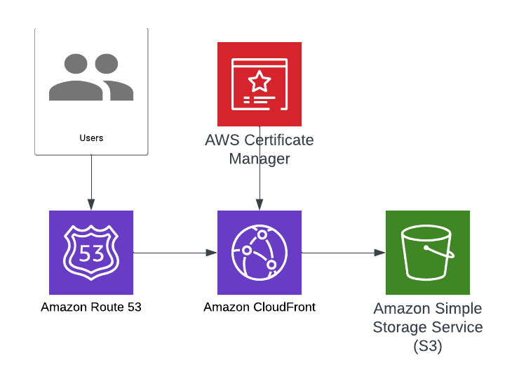

# Resume app IaC

## Diagram
This diagram highlights the services leveraged to deploy the resume IaC leveraging terraform. 

## The website HTML, CSS, etc. is currently being developed another GitHub repo
 The webiste code is located in the resume-app-design repository here: https://github.com/epronobis8/resume-app-design. Currently, I am manually uploading the design to S3, but plan to leverage AWS CodePipeline when code commits are made to the master branch.

## Notes about IaC code
This code leverages existing certificates and domains. I pass the bucket name and arns when deploying code, so they're now stored in GitHub. 